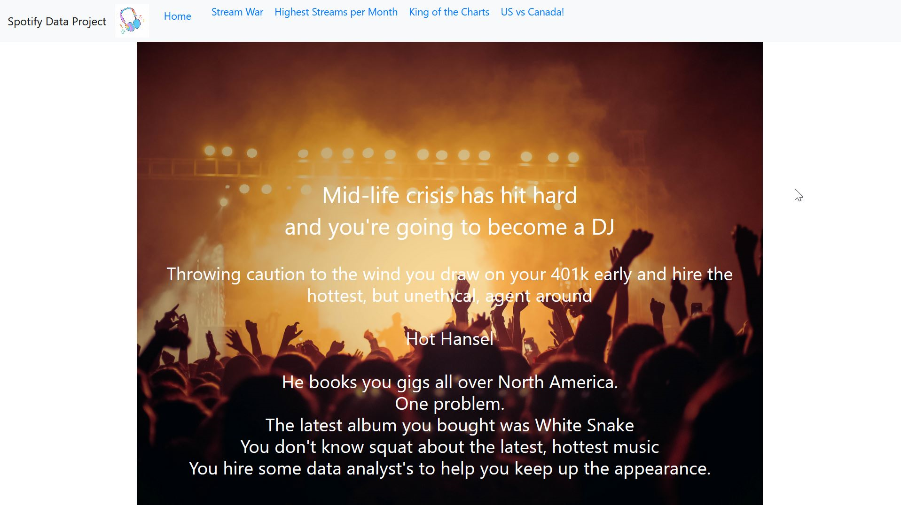
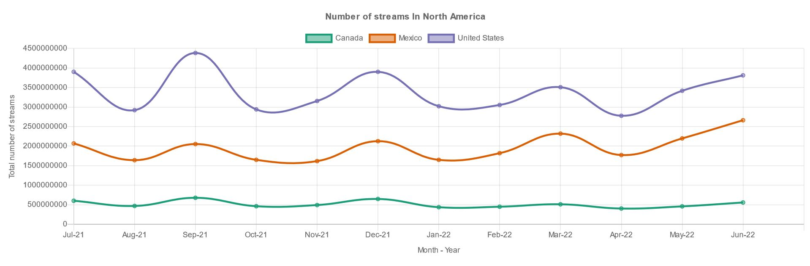

# Project 3 - Data Analysis & Exploration, Back End, Visualizations, Front End Hosting.

Mary Vang, Sandra Braun, Trevor Bridges, Veronica Ostapowich.

## Spotify Weekly Top 200 Songs Streaming Data

### Top 200 songs on Spotify by country from 07/01/2021 - 06/30/2022

* Used the 'final.csv' file from this dataset on kaggle to perform initial data cleaning.
* URLs
1.  https://www.kaggle.com/datasets/yelexa/spotify200
2.  https://developer.spotify.com/documentation/

### This project uses psycopg2 to import the PostgreSQL database into the flask. 

If you do not have psycopg2 already installed. In terminal you will need to use this command:
* "pip install psycopg2"

## Data Analysis and Exploration

* A Dashboard page with multiple charts that all reference the same data was created.
* Python was used to initially clean data set and place into a csv.
* Limited analysis to North America (Canada, Mexico, United States) and Fiscal Year 2022 (July 1, 2021 – June 30, 2022.)
* PostgresSQL and Psycopg2 library were used to import csv data.
* Python Flask API was Set Up.
* Used CSVs to connect to Java Script.

## Data Visualization

* CSV files were created and JavaScript and JQuery were utilized to create visualizations

## Front End Hosting

* HTML and CSS both were utilized to display the data from JavaScript and to create a user interactive experience.
